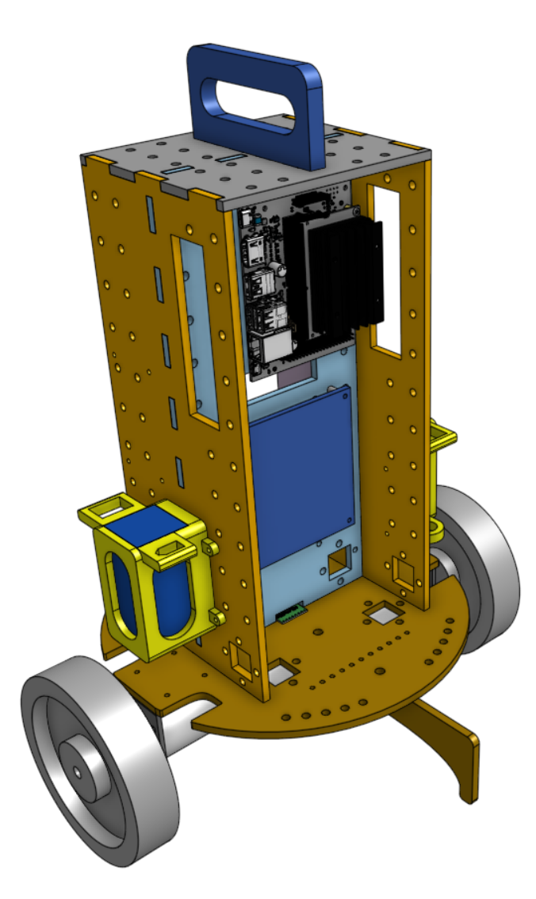

# Overview

## Sim2Real

Gathering real-world data to train a robot can be costly and sample inefficient.

Sim2Real is a proposed solution to this problem and is the study of using simulated environments to train the behaviour of an agent before deploying it in the real-world.

The gap between simulated and real worlds determines the performance of the agent once transferred into real robots. 

There are no consistent set of tools hobbyists use to cross the sim2real gap.

## Solution

We used a two-wheel inverted pendulum (TWIP) robot, NVIDIA Jetson and isaac gym simulation tool  to create an open-source, standard set of software and hardware for better understanding the sim2real gap - setting out to build a robot and simulation environment that could solve the two-wheel inverted pendulum balancing problem with RL.

# The Robot - Two Wheel Inverted Pendulum

We selected the two-wheel inverted pendulum based on its:

Well studied dynamics
Well defined task set

Main Task:
To make the robot autonomously balance only controlling for the speed of the motors.

We designed the robot to allow:
Increased torsional stability
Increased spacing for wiring
Easier battery access

# The Simulation - Isaac Gym

One of the main barriers most simulators face is they rely on complex sequential calculations, which makes it difficult to scale.
Nvidia’s Isaac Gym can perform all the computations on GPU meaning that a single hobbyist-grade GPU can train hundreds of robots in parallel decreasing the cost and computation time.

# Solving TWIP Balancing Problem with Reinforcement Learning

1. Build CAD model (hardware description) of the robot where we define its:

Pendulum length
Radius of wheels
Mass of pendulum body
Mass of wheels

2. Provide hardware description to simulation environment.

3. Train the model of the robot in the simulation environment (Isaac Gym) where we:

Reward the robot for robot for keeping a 0 degree angle between its length and the vertical axis
Punish the robot for deviating from that 0 degree angle.

4. After training until the robot can balance in the simulation, we transfer the model to the NVIDIA Jetson for which we built a standard docker image.

5. The NVIDIA Jetson is mounted to the robot and hooked up to the motors and IMU (device for measuring angular velocity).

6.  The Jetson receives velocity of the wheels and the angle of the IMU and send signals to the motor based on its training in simulation.

7. The TWIP balances.




<!-- ## Welcome to GitHub Pages

You can use the [editor on GitHub](https://github.com/jonah-gourlay44/gym2real/edit/gh-pages/index.md) to maintain and preview the content for your website in Markdown files.

Whenever you commit to this repository, GitHub Pages will run [Jekyll](https://jekyllrb.com/) to rebuild the pages in your site, from the content in your Markdown files.

### Markdown

Markdown is a lightweight and easy-to-use syntax for styling your writing. It includes conventions for

```markdown
Syntax highlighted code block

# Header 1
## Header 2
### Header 3

- Bulleted
- List

1. Numbered
2. List

**Bold** and _Italic_ and `Code` text

[Link](url) and 
```

For more details see [Basic writing and formatting syntax](https://docs.github.com/en/github/writing-on-github/getting-started-with-writing-and-formatting-on-github/basic-writing-and-formatting-syntax).

### Jekyll Themes

Your Pages site will use the layout and styles from the Jekyll theme you have selected in your [repository settings](https://github.com/jonah-gourlay44/gym2real/settings/pages). The name of this theme is saved in the Jekyll `_config.yml` configuration file.

### Support or Contact

Having trouble with Pages? Check out our [documentation](https://docs.github.com/categories/github-pages-basics/) or [contact support](https://support.github.com/contact) and we’ll help you sort it out. -->
